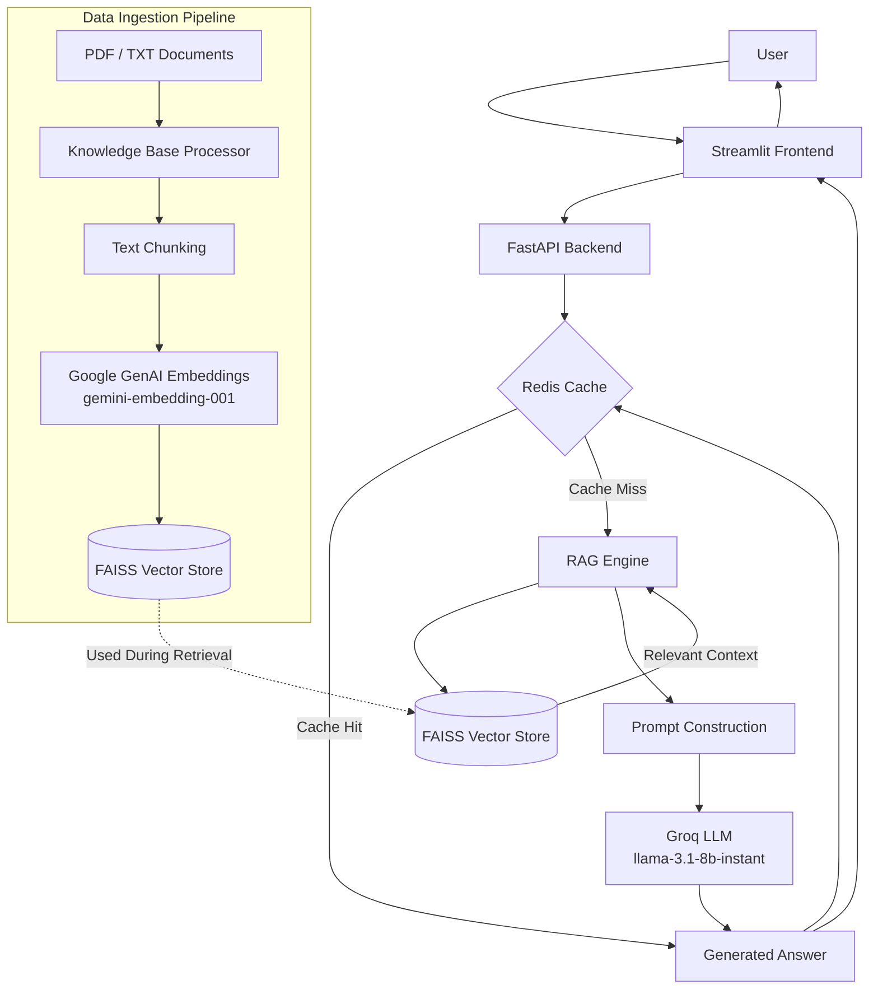

# Med-Bot Architecture 

```mermaid
flowchart TD

    U[User]

    U --> S[Streamlit Frontend]

    S --> F[FastAPI Backend]

    F --> R{Redis Cache}

    R -->|Cache Hit| A[Generated Answer]

    R -->|Cache Miss| C[RAG Engine]

    C --> V[(FAISS Vector Store)]
    V -->|Relevant Context| C

    C --> P[Prompt Construction]

    P --> G[Groq LLM<br/>llama-3.1-8b-instant]

    G --> A

    A --> R

    A --> S
    S --> U

    subgraph Data Ingestion Pipeline

        DOCS[PDF / TXT Documents]
        DOCS --> KB[Knowledge Base Processor]

        KB --> CH[Text Chunking]

        CH --> EMB[Google GenAI Embeddings<br/>gemini-embedding-001]

        EMB --> VS[(FAISS Vector Store)]

    end

    VS -. Used During Retrieval .-> V
```

